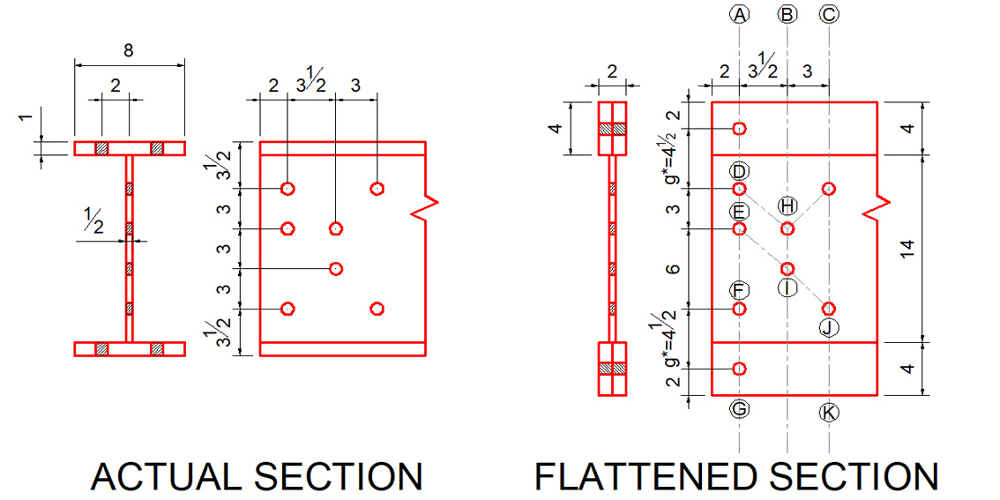

# Problem #1

### I. Problem

Given a non-standard WF shape shown below with ($Fy = 36 ksi$, $Fu = 58 ksi$). The bolts are $\dfrac{3}{4}"$ in diameter. The connection is bolted at the flange and web as shown. Use LRFD method. Use effective gage distance between the flange hole and web hole, $g^*$.

<figure><figcaption>Figure 1.1 Section details</figcaption></figure>

Determine:

1. The value of equivalent gage distance between the web and the adjacent hole $g^*$.
2. The tensile capacity $\phi T_n$ using LRFD method.
3. The allowable tensile load $\dfrac{T_n}{\Omega_t}$ using FS of 1.67 for yielding at gross section and 2.0 for fracture at the connection.
4. Is there a possible failure path if the member is connected at the web only?

### II. Solutions

1. First is to determine the hole diameters of the section. 
   $$
   diameter = \dfrac{3}{4} + \dfrac{1}{8} = \dfrac{7}{8}"
   $$

2. To solve for the equivalent gage distance, $g^*$, half of the flange was first considered (consider this as a leg). Connecting the end of the leg to the end of the web as shown below:

   <figure>
       <figcaption>Figure 2.1</figcaption>
   </figure>

$$
   g^* = 2 \frac{1}{16} + 1 \frac{9}{16} + \frac{7}{16} + \frac{7}{16}
$$

   
g* = 4 1/2"

3. From Figure 1.1, (flattened section), gross sectional area is calculated, $A_g = 23.0 in^2$.

4. Also from figure 1.1, (flattened section), several paths of failures are determined and analyzed, taking into account the non-uniformity of thickness of the section. The following paths are analyzed using `python` programming:

   - A - G
   - C - K
   - A - E - I - F - G

5. Tensile capacity, $\phi_t T_n$ using LRFD method:

   - Calculating yielding at gross section

     $\phi_t Tn = 0.90 \cdot Fy \cdot A_g$, obtains $\phi_t Tn = 745.20 kips$.

   - This analyses of the three (3) paths gives that the path A-G is has the least net area so this path governs and should be analyzed for rupture at connections.
     $$
     A_{net} = A_g - \sum D\cdot t + \sum \dfrac{s^2}{4g}\cdot t
     $$
     $A_{net} = 18.19 in^2$

   - Calculating the tensile capacity for rupture at connection, 
     $$
     \phi_t Tn =  0.75 \cdot Fu \cdot A_{net}
     $$

 obtains $\phi_t Tn = 791.16$. 

 Since yielding at gross section governs, the tensile capacity based on **LRFD** method is

 
&phi;tTn = 745.20 kips

6. Allowable tensile load $\dfrac{T_n}{\Omega_t}$ using ASD method

   - Calculating yielding at gross section

$$
\dfrac{T_n}{\Omega} = \dfrac{Fy\cdot A_g}{1.67}
$$
 	obtains $\dfrac{T_n}{\Omega} = 495.81 kips$ 

   - Using the same net area above, tensile rupture at connection,

     $$
     \dfrac{T_n}{\Omega} = \dfrac{Fu \cdot A_{net}}{2.0}
     $$

     obtains $\dfrac{T_n}{\Omega} = 527.44 kips$

     Since yielding at gross section governs as well, the allowable tensile load based on **ASD** is

     
Tn/&Omega; = 495.81 kips

7. Possible path failure if member is connected at web only. To find this, first is obtaining the tensile failure at weakest path, removing the holes at the thicker portion of the section then compare it to tensile block shear failure taken at A-C-D-F.

   <figure><figcaption>Figure 2.2: Connections at web only</figcaption></figure>

   By calculations, the following are obtained:

   **Tensile rupture at connection at path**

   $\phi_t T_n = 849.07 kips $

   **Block shear capacity**

   $\phi_t T_n = 370.91 kips$

   
Since the block shear capacity is less than the tensile rupture capacity, there will be no path of failure for tensile rupture as the block shear will fail first. Rather, the path will be that of block shear failure.

# Problem # 2

### I. Problem

Select a double angle tension member to carry (40 kips DL) and (20 kips LL), member is (15ft) long and will be connected to any one leg by single line of $\dfrac{7}{8}$" diameter bolts. Use A-36 steel. Assume 3 bolts per line.

### II. Solution

1. Factored load (Required strength of the double angle)
   $$
   T = 1.2(40) + 1.6(20)
   $$

   $$
   T = 80.00 kips
   $$

2. Section selection

   To get the most economical section, I've listed and analyzed five (5) sections for the design.

   | Section         | $A_g$ | $\bar{x}$ | $t$  | $r_x$ |
   | --------------- | ----- | --------- | ---- | ----- |
   | $\angle$4x4x1/2 | 3.75  | 1.18      | 0.50 | 1.21  |
   | $\angle$4x4x1/4 | 1.94  | 1.09      | 0.25 | 1.25  |
   | $\angle$3x3x1/2 | 2.75  | 0.932     | 0.50 | 0.898 |
   | $\angle$3x3x1/4 | 1.382 | 0.839     | 0.25 | 0.932 |
   | $\angle$3x2x1/2 | 2.25  | 0.583     | 0.50 | 0.924 |

3. For the purpose of this problem, I've also selected the LRFD method for the selection of section.

4. Checking for slenderness ratio $\dfrac{L}{r} \leq 300$

   Now checking each section for slenderness ratio, only the last section (L2x2x1/2) exceeded the limit from AISC specification section D1.
   $$
   \dfrac{L}{r}(L2x2x1/2) = 310.34 > 300
   $$
   and so the result from the analysis of this section will be discarded.

5. Assumptions:

   

   The following assumptions are applied in the analysis

   - Distance between center of holes will be $2"$.
   - Distance between the last hole and the tip of the double angles is $2"$.
   - Placement of the hole is in at the center of the longer leg of the angle in case of unequal legs.
   - Distance between backs of the angles are neglected in the calculations as it produces greater value of $r_y$ than $r_x$ which will govern in the calculation of slenderness ratio.

6. For ASTM A36 steel, Standard Specification for Carbon Structural Steel,
   $$
   F_y = 36 ksi
   $$

   $$
   F_u = 58 ksi
   $$

7. Now for each section, tensile yielding is calculated multiplied by 2 for the double angle.
   $$
   T_n = 2\cdot 0.90 \cdot Fy \cdot Ag
   $$

   | Section         | $\phi_t T_n$ |
   | --------------- | ------------ |
   | $\angle$4x4x1/2 | 243.00 kips  |
   | $\angle$4x4x1/4 | 125.71       |
   | $\angle$3x3x1/2 | 178.20       |
   | $\angle$3x3x1/4 | 89.55        |
   | $\angle$3x2x1/2 | 145.80       |

8. Since nonly one leg of the angle is bolted, reduction factor $U$ must be calculated for the effective net area to calculate the tensile rupture.

   | Section         | $U$   |
   | --------------- | ----- |
   | $\angle$4x4x1/2 | 0.705 |
   | $\angle$4x4x1/4 | 0.727 |
   | $\angle$3x3x1/2 | 0.767 |
   | $\angle$3x3x1/4 | 0.790 |
   | $\angle$3x2x1/2 | 0.854 |

9. For the calculation of tensile rupture capacity,
   $$
   T_n =2\cdot 0.75\cdot F_u\cdot A_e
   $$

   | Section         | $\phi_t T_n$ |
   | --------------- | ------------ |
   | $\angle$4x4x1/2 | 199.34 kips  |
   | $\angle$4x4x1/4 | 106.96       |
   | $\angle$3x3x1/2 | 150.14       |
   | $\angle$3x3x1/4 | ==77.83==    |
   | $\angle$3x2x1/2 | 130.06       |

10. Now since I've assumed the location of the bolt, block shear failure capacity can be calculated,

| Section         | $\phi_t T_n$ |
| --------------- | ------------ |
| $\angle$4x4x1/2 | 174.42 kips  |
| $\angle$4x4x1/4 | 87.21        |
| $\angle$3x3x1/2 | 158.22       |
| $\angle$3x3x1/4 | ==79.11==    |
| $\angle$3x2x1/2 | 158.22       |

11. Now based on the above calculations, the section $\angle 3x3x1/4$ failed on both tensile rupture and block shear failure, I will choose the most economical section on the four (4) remaining sections. Rough estimate of the cost can be based on the gross sectional area $A_g$. 

   Now since the section with the least gross sectional areas are $\angle 4x4x1/4$ and $\angle 3x2x1/2$, I would choose either of the two based on the following criteria:

   - If size of the leg is not a restriction, I would choose 

     
<big style="font-size: 2em;">&angle;</big> 4x4x1/4 double angle

References:

American Institute of Steel Construction, Specification for Structural Steel Buildings, 2016

