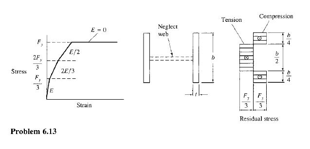
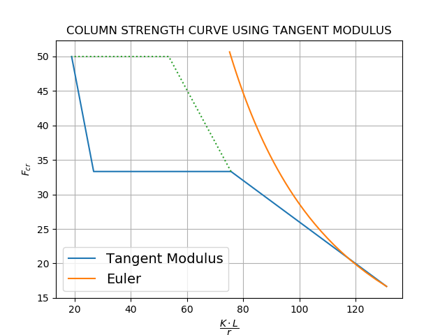

Problem #1

### I. Problem

Using the tangent modulus theory: (a) Construct a column strength ($F_{cr}$ = $P_n/A_g$ vs $KL/r$) for an H-shaped section. Assume weak axis bending ($KL/r$) controls and neglect the effect of the web. Assume the idealized stress-strain relationship shown in the accompanying figure is to be used for each fiber of the cross section, and the residual stress distribution in the flange is as shown. (b) Select the lightest W section to carry a dead load of  65 kips and a live load of 150 kips with an effective length $KL/r$ of $25ft$. Use your constructed curve as the relationship between $F_{cr}$ and $KL/r$. If designing using the LRFD method, use $\phi_c = 0.90$. If designing using the ASD method, use $\Omega_c=1.67$. Use $F_y = 50ksi$. (c) Solve using the AISC specification and compare with tangent modulus theory result.

 

### II. Solutions

**(a) Column strength curve**

By using the given ideal stress strain curve and substituting it as values for critical stress, $F_{cr}$

Case 1: At $F_{cr} = \dfrac{F_y}{3}$

---

Considering tangent modulus of elasticity, $E_t = E$ and the elastic moment of inertia, $I_e = I$

we have
$$
F_{cr} = \dfrac{\pi^2E_t}{[\dfrac{KL}{r}]^2}
$$

$$
\dfrac{F_y}{3} = \dfrac{\pi^2E}{[\dfrac{KL}{r}]^2} \ or \ \dfrac{KL}{r} = \sqrt{\dfrac{\pi^2E}{\dfrac{F_y}{3}}}
$$

at $\dfrac{F_y}{3} = 16.67$, $\dfrac{KL}{r} = 131.05$

Case 2: At $F_{cr} \le \dfrac{2F_y}{3}$:

---

Considering the tangent modulus, $E_t = \dfrac{2E}{3}$ while the section remains elastic $I_e = I$
$$
\dfrac{2F_y}{3} = \dfrac{\pi^2(\dfrac{2E}{3})}{[\dfrac{KL}{r}]^2} \ or \ \dfrac{KL}{r} = \sqrt{\dfrac{\pi^2(\dfrac{2E}{3})}{\dfrac{2F_y}{3}}}
$$
then, at $\dfrac{2F_y}{3} = 33.33$, $\dfrac{KL}{r} = 75.66$

Case 3: At $F_{cr} \ge \dfrac{2F_y}{3}$:

---

Considering the elastic moment of inertia, $I_e \lt I$ when the tips of the flange has already yielded,

by getting the ratio $\dfrac{I_e}{I}$,
$$
\dfrac{I_e}{I} = \dfrac{(\dfrac{b}{2})^3}{b^3} = \dfrac{1}{8}
$$
substituting to the original equation,
$$
\dfrac{KL}{r} = \sqrt{\dfrac{\pi^2(\dfrac{2E}{3})(\dfrac{1}{8})}{\dfrac{2F_y}{3}}}
$$
solving gets, $\dfrac{KL}{r} = 26.75$

Case 4: At $F_{cr} < F_y$:

---

Considering the tangent modulus $E_t = \dfrac{E}{2}$ and the elastic moment of inertia $I_e = I$

substituting, we have
$$
\dfrac{KL}{r} = \sqrt{\dfrac{\pi^2 \dfrac{E}{2}}{F_y}}
$$
solving gets, $\dfrac{KL}{r} = 53.50$

Case 5: $F_{cr} > F_y$:

---

having the same tangent modulus as case 4 but with $I_e < I $,

using ratio $\dfrac{I_e}{I} = \dfrac{1}{8}$
$$
\dfrac{KL}{r} = \sqrt{\dfrac{\pi^2 (\dfrac{E}{2}) (\dfrac{1}{8})}{F_y}}
$$
solving we got, $\dfrac{KL}{r} = 18.91$

By solving until $F_{cr}$ reached $F_y$, we can see the graph as below:

**(b) Lightest W section**

Using LRFD method
$$
P_u = 1.2(65) + 1.6(150)
$$

$$
P_u = 318 \ kips
$$

Estimating the critical stress for an effective length of 25 ft. using an assumed slenderness ratio of 120.

By interpolating from the computed points of column strength curve between (131.05, 16.67) and (75.66, 33.33), we can have $F_{cr} = 20 \ ksi$

Determining the required gross section area:
$$
\phi_cF_{cr} = \dfrac{P_u}{A_g{required}}
$$

$$
A_grequired = 17.67\ in^2
$$

Try W14x90, From the AISC Steel Sections Table 1-1

| $r_y$ | $3.70 \ in^2$  |
| ----- | -------------- |
| $A_g$ | $26.50 \ in^2$ |

Assuming a pinned section in both ends, K=1
$$
\dfrac{KL}{r} = \dfrac{25 x 12}{3.70} = 81.08
$$
By interpolation, we get $F_{cr} = 31.69$

Determining the strength of the section:

$\phi_c P_n = \phi_c F_{cr} A_g$

$\phi_c P_n = \phi_c (81.08) (26.50)$

$\phi_c P_n = 1,933.76 \ kips  \  >  P_u$

Try lighter section, W14x61,

| $r_y$ | $2.45 \ in^2$  |
| ----- | -------------- |
| $A_g$ | $17.90 \ in^2$ |

$$
\dfrac{KL}{r} = \dfrac{25 x 12}{2.45} = 122.45
$$

By interpolation, $F_{cr} = 19.26$

$\phi_c P_n = \phi_c (19.26) (17.90)$

$\phi_c P_n = 310.28 \ kips  <  P_u$

Try another section, W14x68,

| $r_y$ | $2.46 \ in^2$  |
| ----- | -------------- |
| $A_g$ | $20.00 \ in^2$ |

$$
\dfrac{KL}{r} = \dfrac{25 x 12}{2.46} = 121.95
$$

By interpolation, $F_{cr} = 19.406$

$\phi_c P_n = \phi_c (19.40) (20.00)$

$\phi_c P_n = 349.20 \ kips  >  P_u$

Therefore, the lightest section for this analysis is

<big style="font-size: 2em;">W14x68

**(c) Compare with AISC specification**

Using the same section, W14x68:

*Slenderness Check:*

Using $K_x$ and $K_y$ equal to 1.0 for pinned sections,

$L_{cy} = 1.0 (25) = \ 25$

$\dfrac{L_{cy}}{ry} = $ 121.95

*With to thickness ratio of flanges:*

$\dfrac{b_f}{2t_f} = \dfrac{10.0}{2(0.72)} = 6.94$

Limit:

$0.56 \sqrt{\dfrac{E}{Fy}} = 13.48 > 6.94$, Therefore the flanges are non-slender

*Width to thickness ratio of the web:*

$\dfrac{h}{t_w} = 27.50$

Limit:

$1.49 \sqrt{\dfrac{E}{F_y}} = 35.88 > 27.50$, Therefore the web is non-slender

Since web and flanges are non-slender, limit state of local buckling does not apply

*Calculating the Critical Stress$:*

$F_e = \dfrac{\pi^2E}{(\dfrac{L_{cy}}{r})^2} = 19.24$

Flexural buckling stress,

$4.71\sqrt{\dfrac{E}{F_y}} = 113.43  <  121.95$, therefore

$F_{cr} = 0.877F_e = 16.87$

$\phi_c P_n = \phi_c (16.87) (20.00) = 303.70 kips < P_u$

<big style="font-size: 2em;">By selecting the same section used in tangent modulus, it was not enough using the AISC specifications by 14.3kips while using the tangent modulus method, the section is 31.2kips more adequate than the required strength. It is then concluded that the AISC specification is more conservative in this problem.

